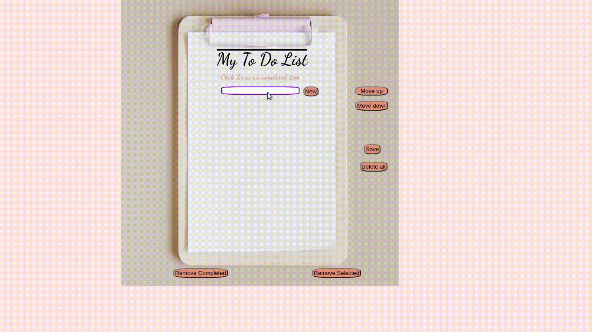

# Welcome to To Do List Project!

## Goal
Adapt this [Web screen](https://carolbezerra-dev.github.io/trybe-projects-front-end/1.Fundamentals/5.DOM-Selectors/ToDo-List/) to Mobile version, keeping the main characteristics.

<!-- ### 💡 See the following example of what the project might look like  

 -->

## What I practiced with this project:

- Add image as background
- Add custom font and color
- Manipulate TextField
- Manipulate Buttons
- Manipulate Gestures (tap, long press and swipe)
- Work with List
- Add, delete one and delete all items
- Persist data using UserDefaults (SwiftUI)
- Persist data using Core Data (UIKit)

### Device used during development: iPhone 14 Pro by Xcode Simulator

## The app must have:

### 1 - a title

- put a overline
- `"My To Do List"`
- font `Dancing Script - Bold`
- `size 30`

### 2 - an instruction

- `"Long press in a completed item"`
- font `Dancing Script - Regular`
- size `16`
- color `darksalmon`

### 3 - an text field to add item in the list

- color `darkviolet`
- border width `2` 
- corner `radius`

### 4 - add button, when tapped:

- a new item must be created at the end of the list
- text field must be cleared

### 5 - list item:

- font `IndieFlower`
- size `20`
- color `crimson`

### 6 - delete all button, when tapped:

- all items are replaced for a blank line

### 7 - when tapping on an item of the list:

- change the background color to `rgb limoncello (255, 255, 131)`
- more than one task can be selected at same time
- if the task is selected and you tap again, background color should be changed to `systemGroupedBackground`

### 8 - when long press on an item in the list:

- it should be `strikethrough (crossed out)`, indicating that it has been completed
- more than one task can be completed at same time
- if the task is completed and you long press again, the `strikethrough (crossed out)` should be removed

### 9 - delete one item:

- when swiping to left, it should delete this specific item from the list

### 10 - if you close and reopen the app, the list should continue as it was

- persist items
- persist completed items
- do not persist selected items
